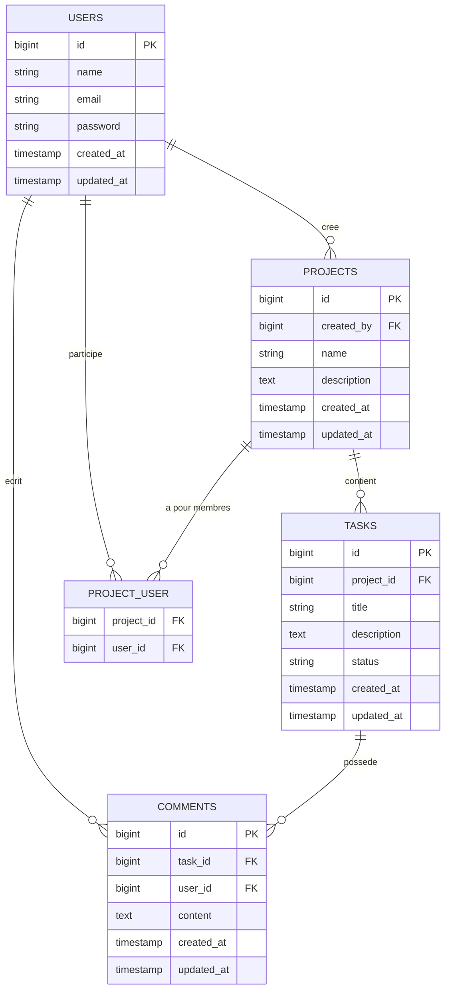

---
# Version corrigée de ton README

Tu peux remplacer ton contenu actuel par celui-ci :

````markdown
# API de gestion de tâches d'équipe

## 📌 Présentation

Cette application est une API REST développée avec Laravel permettant à plusieurs utilisateurs de travailler ensemble sur des projets.

L'API permet de :

- gérer les utilisateurs ;
- créer et gérer des projets ;
- associer plusieurs utilisateurs à un projet ;
- créer et gérer des tâches ;
- associer les tâches à un projet ;
- ajouter des commentaires aux tâches ;
- gérer l'authentification des utilisateurs.
---

# 🧩 Entités

L'application possède quatre entités principales :

- `User`
- `Project`
- `Task`
- `Comment`

---

# 🔗 Relations entre les entités

## User → Project

Un utilisateur peut créer plusieurs projets.

Un projet est créé par un utilisateur.

**Relation :**

`User 1 ---- N Project`

---

## User ↔ Project

Plusieurs utilisateurs peuvent travailler sur un même projet.

Un utilisateur peut également travailler sur plusieurs projets.

**Relation :**

`User N ---- N Project`

Cette relation nécessite une table pivot :

`project_user`

Elle contient :

- `project_id`
- `user_id`

---

## Project → Task

Un projet peut posséder plusieurs tâches.

Une tâche appartient à un seul projet.

**Relation :**

`Project 1 ---- N Task`

La table `tasks` possède donc une clé étrangère :

`project_id`

---

## Task → Comment

Une tâche peut avoir plusieurs commentaires.

Un commentaire appartient à une seule tâche.

**Relation :**

`Task 1 ---- N Comment`

La table `comments` possède donc une clé étrangère :

`task_id`

---

## User → Comment

Un utilisateur peut écrire plusieurs commentaires.

Un commentaire est écrit par un seul utilisateur.

**Relation :**

`User 1 ---- N Comment`

La table `comments` possède donc une clé étrangère :

`user_id`

---

# 🗄️ Schéma relationnel



---

# 🌐 Endpoints de l'API

L'API utilise le préfixe `/api`.

Les routes protégées nécessitent une authentification avec un token.

---

## 🔐 Authentification

| Méthode | URL             | Rôle                        | Auth |
| ------- | --------------- | --------------------------- | ---- |
| POST    | `/api/register` | Créer un compte utilisateur | ❌   |
| POST    | `/api/login`    | Authentifier un utilisateur | ❌   |
| POST    | `/api/logout`   | Déconnecter l'utilisateur   | ✅   |

### `POST /api/register`

Permet de créer un nouveau compte utilisateur.

### `POST /api/login`

Permet à un utilisateur de se connecter et d'obtenir un token d'authentification.

### `POST /api/logout`

Permet à l'utilisateur authentifié de se déconnecter.

---

# 👤 Utilisateurs

| Méthode | URL                 | Rôle                     | Auth |
| ------- | ------------------- | ------------------------ | ---- |
| GET     | `/api/users`        | Lister les utilisateurs  | ✅   |
| GET     | `/api/users/{user}` | Consulter un utilisateur | ✅   |

### `GET /api/users`

Retourne la liste des utilisateurs.

### `GET /api/users/{user}`

Retourne les informations d'un utilisateur précis.

---

# 📁 Projets

| Méthode | URL                       | Rôle                             | Auth |
| ------- | ------------------------- | -------------------------------- | ---- |
| GET     | `/api/projects`           | Lister les projets accessibles   | ✅   |
| POST    | `/api/projects`           | Créer un projet                  | ✅   |
| GET     | `/api/projects/{project}` | Consulter un projet              | ✅   |
| PUT     | `/api/projects/{project}` | Modifier complètement un projet  | ✅   |
| PATCH   | `/api/projects/{project}` | Modifier partiellement un projet | ✅   |
| DELETE  | `/api/projects/{project}` | Supprimer un projet              | ✅   |

### `GET /api/projects`

Retourne les projets auxquels l'utilisateur peut accéder.

### `POST /api/projects`

Permet à un utilisateur authentifié de créer un projet.

### `GET /api/projects/{project}`

Retourne les informations d'un projet.

### `PUT /api/projects/{project}`

Permet de remplacer les informations d'un projet.

### `PATCH /api/projects/{project}`

Permet de modifier partiellement un projet.

### `DELETE /api/projects/{project}`

Supprime un projet.

---

# 👥 Membres d'un projet

Un projet peut être associé à plusieurs utilisateurs.

| Méthode | URL                                    | Rôle                         | Auth |
| ------- | -------------------------------------- | ---------------------------- | ---- |
| GET     | `/api/projects/{project}/users`        | Lister les membres du projet | ✅   |
| POST    | `/api/projects/{project}/users`        | Ajouter un membre au projet  | ✅   |
| DELETE  | `/api/projects/{project}/users/{user}` | Retirer un membre du projet  | ✅   |

### `GET /api/projects/{project}/users`

Retourne la liste des utilisateurs travaillant sur le projet.

### `POST /api/projects/{project}/users`

Ajoute un utilisateur à un projet.

### `DELETE /api/projects/{project}/users/{user}`

Retire un utilisateur du projet.

---

# ✅ Tâches

| Méthode | URL                             | Rôle                             | Auth |
| ------- | ------------------------------- | -------------------------------- | ---- |
| GET     | `/api/projects/{project}/tasks` | Lister les tâches d'un projet    | ✅   |
| POST    | `/api/projects/{project}/tasks` | Créer une tâche                  | ✅   |
| GET     | `/api/tasks/{task}`             | Consulter une tâche              | ✅   |
| PUT     | `/api/tasks/{task}`             | Modifier complètement une tâche  | ✅   |
| PATCH   | `/api/tasks/{task}`             | Modifier partiellement une tâche | ✅   |
| DELETE  | `/api/tasks/{task}`             | Supprimer une tâche              | ✅   |

### `GET /api/projects/{project}/tasks`

Retourne les tâches appartenant au projet.

### `POST /api/projects/{project}/tasks`

Crée une nouvelle tâche dans le projet.

### `GET /api/tasks/{task}`

Retourne les informations d'une tâche.

### `PUT /api/tasks/{task}`

Modifie complètement une tâche.

### `PATCH /api/tasks/{task}`

Modifie partiellement une tâche.

### `DELETE /api/tasks/{task}`

Supprime une tâche.

---

# 💬 Commentaires

| Méthode | URL                          | Rôle                                  | Auth |
| ------- | ---------------------------- | ------------------------------------- | ---- |
| GET     | `/api/tasks/{task}/comments` | Lister les commentaires d'une tâche   | ✅   |
| POST    | `/api/tasks/{task}/comments` | Ajouter un commentaire                | ✅   |
| GET     | `/api/comments/{comment}`    | Consulter un commentaire              | ✅   |
| PUT     | `/api/comments/{comment}`    | Modifier un commentaire               | ✅   |
| PATCH   | `/api/comments/{comment}`    | Modifier partiellement un commentaire | ✅   |
| DELETE  | `/api/comments/{comment}`    | Supprimer un commentaire              | ✅   |

### `GET /api/tasks/{task}/comments`

Retourne tous les commentaires associés à une tâche.

### `POST /api/tasks/{task}/comments`

Ajoute un commentaire à une tâche.

### `GET /api/comments/{comment}`

Retourne un commentaire précis.

### `PUT /api/comments/{comment}`

Modifie complètement un commentaire.

### `PATCH /api/comments/{comment}`

Modifie partiellement un commentaire.

### `DELETE /api/comments/{comment}`

Supprime un commentaire.

---

# 📊 Résumé des endpoints

| Domaine  | Méthode | Endpoint                               |
| -------- | ------- | -------------------------------------- |
| Auth     | POST    | `/api/register`                        |
| Auth     | POST    | `/api/login`                           |
| Auth     | POST    | `/api/logout`                          |
| Users    | GET     | `/api/users`                           |
| Users    | GET     | `/api/users/{user}`                    |
| Projects | GET     | `/api/projects`                        |
| Projects | POST    | `/api/projects`                        |
| Projects | GET     | `/api/projects/{project}`              |
| Projects | PUT     | `/api/projects/{project}`              |
| Projects | PATCH   | `/api/projects/{project}`              |
| Projects | DELETE  | `/api/projects/{project}`              |
| Membres  | GET     | `/api/projects/{project}/users`        |
| Membres  | POST    | `/api/projects/{project}/users`        |
| Membres  | DELETE  | `/api/projects/{project}/users/{user}` |
| Tasks    | GET     | `/api/projects/{project}/tasks`        |
| Tasks    | POST    | `/api/projects/{project}/tasks`        |
| Tasks    | GET     | `/api/tasks/{task}`                    |
| Tasks    | PUT     | `/api/tasks/{task}`                    |
| Tasks    | PATCH   | `/api/tasks/{task}`                    |
| Tasks    | DELETE  | `/api/tasks/{task}`                    |
| Comments | GET     | `/api/tasks/{task}/comments`           |
| Comments | POST    | `/api/tasks/{task}/comments`           |
| Comments | GET     | `/api/comments/{comment}`              |
| Comments | PUT     | `/api/comments/{comment}`              |
| Comments | PATCH   | `/api/comments/{comment}`              |
| Comments | DELETE  | `/api/comments/{comment}`              |

---

## 🔒 Authentification

Pour les endpoints protégés, le client doit fournir le token :

```http
Authorization: Bearer <token>

Accept: application/json
```

```

```
